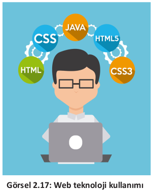
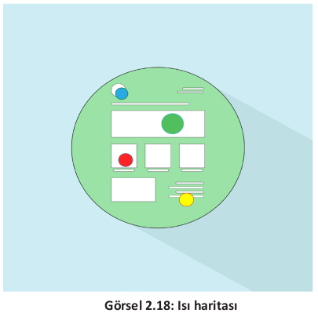

# 2.5. Güncellik

Web sitesi hazırlanırken dikkat edilmesi gereken unsurlardan bir tanesi de güncelliktir. Sitede içerikle ilgili tüm bilgiler güncel tutulmalıdır. Haber, etkinlik, duyuru gibi eski tarihli bilgiler arşiv şeklinde ayrı bir bölümde tutulmalıdır. Güncel içerikli web sitelerinin arama motoru sonuç sıralamasında üst sıralarda yer alacağı unutulmamalıdır.

Web sitesi hazırlanırken yeni teknolojilerin kullanılması web sitesinin güncel platformlarda hatasız çalışması açısından önemlidir. Kullanılan kodlama teknolojisi ile site güncel ve sağlıklı çalışır hâle getirilebilir. Web teknolojileri ve kodlama dillerinde HTML5, CSS3  gibi yeni teknolojilerin kullanılması farklı platformlarda da (akıllı telefon, tablet vb.) içeriği sorunsuz çalıştıracaktır (Görsel 2.17). Duyarlı (responsive) tasarımlar ile web siteleri görüntülendiği ekran boyutuyla uyumlu hâle gelecektir. Responsive tasarımlar yaparken CSS çatılarını (framework) kullanmak kodlama aşamasında kodlayıcının işini kolaylaştıracaktır. Sadece birkaç satır kod ekleyerek hem her cihaza uygun tasarımlar yapabilecek hem de çalışmanın birçok tarayıcıda sorunsuz çalışması sağlanacaktır.

**Araştırma**

>Arkadaşlarınızla küçük gruplar oluşturunuz. Yaygın olarak kullanılan CSS frameworklerini araştırıp avantaj ve dezavantajlarını anlatan bir sunum hazırlayınız.

Yeni teknoloji ile hazırlanan web sitelerine, sitenin kullanıcı üzerindeki etkililiğini ölçmeye yarayan araçlar da eklenebilir. Isı haritaları ve dönüşüm izleme gibi araçlar sayesinde web sitesinde ziyaretçilerin sayfadaki hareketleri (en çok nelere tıkladığı, en çok hangi ürünle ilgilendiği, hangi sayfada ne kadar süre geçirdiği gibi) analiz edilir ve analiz sonucunda web sitesinin güçlü ve zayıf yönleri de tespit edilerek sitenin daha güncel kalması sağlanır (Görsel 2.18).

