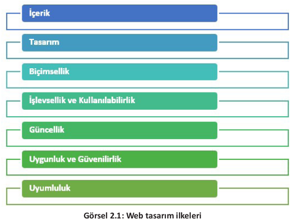
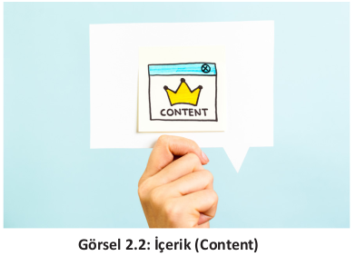

# 2.1. İçerik

Kurum, işletme veya bireyleri internet ortamında temsil eden web siteleri hazırlanırken dikkat edilmesi gereken birtakım ilkeler vardır (Görsel 2.1). Tasarım sürecinde bu ilkelerin göz önünde bulundurulması, hazırlanacak olan web sitesinin kalitesi, profesyonelliği ve site ziyaretçileri tarafından kullanışlılığı açısından oldukça önemlidir.

Web tasarım ilkelerinin başında, web sitesinin temeli olan içerik oluşturma gelmektedir
(Görsel 2.2). Web sitesinin en önemli amacı içeriği tüm dünyadaki ziyaretçiler ile paylaşmak olduğundan, tasarıma başlandığı andan itibaren
yapılması gereken ilk iş içerik planlaması olmalıdır. Web sitesi içeriği (web site content); görsel, metinsel ve işitsel materyallerden oluşur.
İçeriklerin birbirine uygun grafik ve metinler ile
harmanlanması sitenin kalitesi açısından önemlidir.

İçerikler hedef kitleye hitap edecek şekilde hazırlanmalı, gereğinden fazla öge kullanılmamasına dikkat edilmelidir. Web sitesi oluşturulurken kullanılan dil de çok önemlidir. İçerikteki yazılar
anlaşılır; net ve doğal bir dil kullanılarak oluşturulmalıdır.\
İçerik; özgün, güncel, bilgilendirici, dikkat çekici ve SEO [Search Engine Optimization (Arama
Motoru Optimizasyonu)] uyumlu olmalıdır. İçeriğin konu ile ilgili anahtar kelimeler barındırması gerekir.\
İçerik hazırlama esnasında kullanılan metin, resim ve videolar gruplara ayrılmalıdır. Metin, resim ve videoların içerik hazırlanırken gruplandırılması karmaşayı önler.\
İçerikte kullanılacak metinler kadar tercih edilen görseller de önemlidir. Metin ve grafiklerdeki
renkler ile fontlar (yazı tipleri) dikkatli seçilmeli ve içerik sade bir şekilde tasarlanmalıdır. Seçilen
yazı tipi tüm dijital cihazlarda ve farklı tarayıcılarda doğru çalışmalı ve kullanıcı dostu olmalıdır.
Seçilen grafikler ve videolar sayfanın yüklenme hızını olumsuz etkilemeyecek formatlarda olmalıdır.

**Not**

>Arama Motoru Optimizasyonu (SEO), bir sitenin arama motorlarında daha iyi sıralamalar elde etmesi, daha iyi performans göstererek daha fazla nitelikli ziyaretçiye ulaşabilmesi amacıyla yapılan çalışmalardır.
