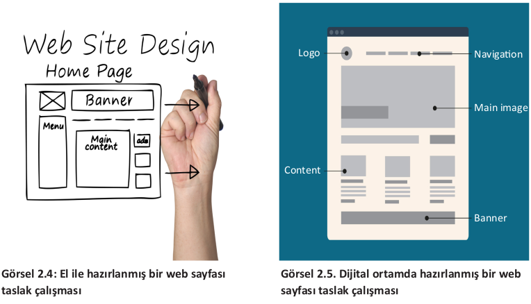

### 2.2. Tasarım
Web tasarım ilkelerinden biri olan tasarım (design), web sitesindeki içeriklerin yerleşim planla-
masının yapıldığı (içeriğin sayfanın neresinde ve nasıl konumlandığı) kısımdır (Görsel 2.3).

Site yerleşim planı, siteyi ziyaret eden kişilerin güvenini kazanmak için önemlidir. Gelişigüzel
yapılmış bir yerleşim planı ziyaretçilerin siteyi bir daha ziyaret etmemelerine sebep olabilir. Bu
nedenle sitede kullanılacak bileşenlerin konumlarının doğru planlanmasına dikkat etmek gerekir.\
Tasarım aşamasında görünümün nasıl olacağı, içeriğin nerede gösterileceği, logo, görseller ve me-
nülerin konumu, renk ve tipografi düzeninin nasıl olacağı, başlık ve taban görünümü gibi düzen-
lemelerin tümüne karar verilir. Web sitesi tasarımına başlamadan önce hazırlanmak istenen site-
nin taslak çalışması (site bileşenlerinin sayfadaki konumu) kâğıt üzerinde el ile (Görsel 2.4) veya
dijital ortamda (Görsel 2.5) hazırlanır. Böylece hazırlanmış arayüz sayesinde hem sitenin taslağı
oluşmuş hem de eklenmemiş bir bileşenden dolayı yaşanacak zaman kaybının önüne geçilmiş olur.

Web sitesi tasarımı sırasında sitede yer alan bileşenler tasarımcının planlamasına ve bakış açısına göre farklılıklar gösterebilir ancak temel özelliklerin dışına fazla çıkılmaması kullanıcılar açısın
dan tutarlılık ve kullanım rahatlığı sağlayacaktır. Sitede yer alan bileşenlerin (menüler, logo, içerik,
reklam vs.) konumu ziyaretçilerin alışkanlıkları doğrultusunda olmalıdır (Görsel 2.6, Görsel 2.7).

### Not

>Banner’lar, üzerinde yazı ve grafiklerin bulunduğu, reklam ve tanıtım amacı ile
kullanılan görsel bileşenlerdir. Sayfanın reklam içerik kısmında yer alabileceği gibi,
web sitelerinde logo ile birlikte tasarlanıp sayfanın başlık kısmında da yer alabilirler.

Web sitesi tasarımında kullanılan en önemli bileşenlerden biri menülerdir. Anasayfa (web sitesi yüklendiğinde karşımıza çıkan ilk sayfa) dışında yer alan sayfalara köprüler (link) aracılığı ile
erişebilmekteyiz. Menüler kullanıcıların aradıkları bilgilere erişebilmek için kullanılan bağlantıların gruplandırıldığı alanlardır. Menüler web sayfasının alt bilgi bölümü (footer), üst bilgi bölümü
(header) veya sağ/sol yanında (sidebar) konumlandırılabilir. En yaygın kullanımı sol yan ve üst bölümde yer alan tasarımdır. Web sitelerinin üstbilgi kısmında genellikle menüler, banner, site başlığı, sosyal medya bağlantı simgeleri ve logo gibi bileşenler bulunur. Menü kısmında sitede kullanılan menüler, content kısmında sitenin içerik alanı, alt bilgi kısmında ise iletişim adresleri, telif
bilgileri, iletişim ve site haritası bağlantıları gibi seçenekler yer alır.

### Not

>İletişim bölümü sitenin alt bölümünde olabileceği gibi sitenin üst kısmında veya
menüler arasında da yer alabilmektedir. Önemli olan bu bölümün sitede mutlaka
olması ve rahatça erişilebilecek bir konumda yer almasıdır.
