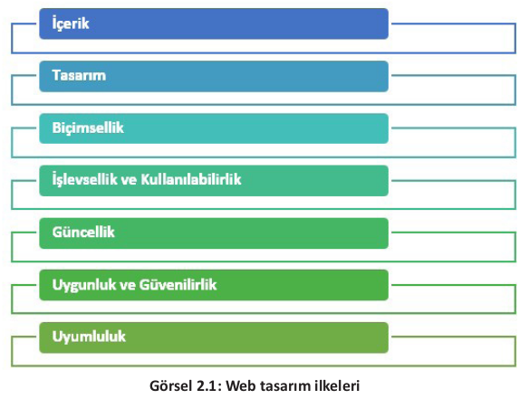
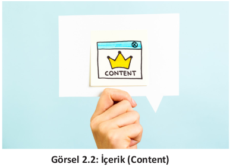
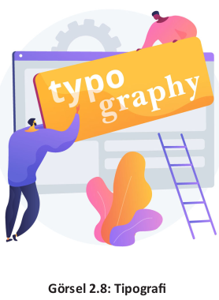

# ÖĞRENME BİRİMİ 2 : TEMEL KAVRAMLAR

## NELER ÖĞRENECEKSİNİZ?

Bu öğrenme birimi ile;
- Web tasarım ilkelerinin neler olduğunu açıklamayı,
- Web tasarımı sırasında içerik ve tasarım ilişkisini kurmayı,
- Web sitesinde bulunan bileşenlerin sayfadaki konumunu belirlemeyi,
- Dijital ortamda ve el ile web sayfası taslağı oluşturmayı,
- Web tasarım ilkelerine ve tipografik kurallara uygun web sayfası taslağı hazırlamayı öğreneceksiniz.

### Hazırlık Çalışmaları

1. Aynı özelliklere sahip iki işletme tanıtım amaçlı Web sitesi tasarımı yaparak yayınlamışlardır. Web sitelerinden birisinin ziyaretçileri oldukça fazla diğerinin ki ise
çok azdır. Bu durum hangi nedenlerden kaynaklanmış olabilir?
2. Bir web sitesini ziyaret ettiğinizde gözünüze ilk çarpan olumlu ve olumsuz özellikler nelerdir?

### ANAHTAR KELİMELER

Biçimsellik, güncellik, içerik, işlevsellik, kullanılabilirlik, media query, mobil uyumluluk,
responsive, SEO, tarayıcı uyumluluğu, tasarım, tipografi.

### 2.1. İçerik
Kurum, işletme veya bireyleri internet ortamında temsil eden web siteleri hazırlanırken dikkat
edilmesi gereken birtakım ilkeler vardır (Görsel 2.1). Tasarım sürecinde bu ilkelerin göz önünde
bulundurulması, hazırlanacak olan web sitesinin kalitesi, profesyonelliği ve site ziyaretçileri tarafından kullanışlılığı açısından oldukça önemlidir.

Web tasarım ilkelerinin başında, web sitesinin temeli olan içerik oluşturma gelmektedir
(Görsel 2.2). Web sitesinin en önemli amacı içeriği tüm dünyadaki ziyaretçiler ile paylaşmak olduğundan, tasarıma başlandığı andan itibaren
yapılması gereken ilk iş içerik planlaması olmalıdır. Web sitesi içeriği (web site content); görsel, metinsel ve işitsel materyallerden oluşur.
İçeriklerin birbirine uygun grafik ve metinler ile
harmanlanması sitenin kalitesi açısından önemlidir.

İçerikler hedef kitleye hitap edecek şekilde hazırlanmalı, gereğinden fazla öge kullanılmamasına dikkat edilmelidir. Web sitesi oluşturulurken kullanılan dil de çok önemlidir. İçerikteki yazılar
anlaşılır; net ve doğal bir dil kullanılarak oluşturulmalıdır.\
İçerik; özgün, güncel, bilgilendirici, dikkat çekici ve SEO [Search Engine Optimization (Arama
Motoru Optimizasyonu)] uyumlu olmalıdır. İçeriğin konu ile ilgili anahtar kelimeler barındırması gerekir.\
İçerik hazırlama esnasında kullanılan metin, resim ve videolar gruplara ayrılmalıdır. Metin, resim ve videoların içerik hazırlanırken gruplandırılması karmaşayı önler.\
İçerikte kullanılacak metinler kadar tercih edilen görseller de önemlidir. Metin ve grafiklerdeki
renkler ile fontlar (yazı tipleri) dikkatli seçilmeli ve içerik sade bir şekilde tasarlanmalıdır. Seçilen
yazı tipi tüm dijital cihazlarda ve farklı tarayıcılarda doğru çalışmalı ve kullanıcı dostu olmalıdır.
Seçilen grafikler ve videolar sayfanın yüklenme hızını olumsuz etkilemeyecek formatlarda olmalıdır.

### Not
>Arama Motoru Optimizasyonu (SEO), bir sitenin arama motorlarında daha iyi sıralamalar elde etmesi, daha iyi performans göstererek daha fazla nitelikli ziyaretçiye
ulaşabilmesi amacıyla yapılan çalışmalardır.

### 2.2. Tasarım
Web tasarım ilkelerinden biri olan tasarım (design), web sitesindeki içeriklerin yerleşim planla-
masının yapıldığı (içeriğin sayfanın neresinde ve nasıl konumlandığı) kısımdır (Görsel 2.3).

Site yerleşim planı, siteyi ziyaret eden kişilerin güvenini kazanmak için önemlidir. Gelişigüzel
yapılmış bir yerleşim planı ziyaretçilerin siteyi bir daha ziyaret etmemelerine sebep olabilir. Bu
nedenle sitede kullanılacak bileşenlerin konumlarının doğru planlanmasına dikkat etmek gerekir.\
Tasarım aşamasında görünümün nasıl olacağı, içeriğin nerede gösterileceği, logo, görseller ve me-
nülerin konumu, renk ve tipografi düzeninin nasıl olacağı, başlık ve taban görünümü gibi düzen-
lemelerin tümüne karar verilir. Web sitesi tasarımına başlamadan önce hazırlanmak istenen site-
nin taslak çalışması (site bileşenlerinin sayfadaki konumu) kâğıt üzerinde el ile (Görsel 2.4) veya
dijital ortamda (Görsel 2.5) hazırlanır. Böylece hazırlanmış arayüz sayesinde hem sitenin taslağı
oluşmuş hem de eklenmemiş bir bileşenden dolayı yaşanacak zaman kaybının önüne geçilmiş olur.

Web sitesi tasarımı sırasında sitede yer alan bileşenler tasarımcının planlamasına ve bakış açısına göre farklılıklar gösterebilir ancak temel özelliklerin dışına fazla çıkılmaması kullanıcılar açısın
dan tutarlılık ve kullanım rahatlığı sağlayacaktır. Sitede yer alan bileşenlerin (menüler, logo, içerik,
reklam vs.) konumu ziyaretçilerin alışkanlıkları doğrultusunda olmalıdır (Görsel 2.6, Görsel 2.7).

### Not

>Banner’lar, üzerinde yazı ve grafiklerin bulunduğu, reklam ve tanıtım amacı ile
kullanılan görsel bileşenlerdir. Sayfanın reklam içerik kısmında yer alabileceği gibi,
web sitelerinde logo ile birlikte tasarlanıp sayfanın başlık kısmında da yer alabilirler.

Web sitesi tasarımında kullanılan en önemli bileşenlerden biri menülerdir. Anasayfa (web sitesi yüklendiğinde karşımıza çıkan ilk sayfa) dışında yer alan sayfalara köprüler (link) aracılığı ile
erişebilmekteyiz. Menüler kullanıcıların aradıkları bilgilere erişebilmek için kullanılan bağlantıların gruplandırıldığı alanlardır. Menüler web sayfasının alt bilgi bölümü (footer), üst bilgi bölümü
(header) veya sağ/sol yanında (sidebar) konumlandırılabilir. En yaygın kullanımı sol yan ve üst bölümde yer alan tasarımdır. Web sitelerinin üstbilgi kısmında genellikle menüler, banner, site başlığı, sosyal medya bağlantı simgeleri ve logo gibi bileşenler bulunur. Menü kısmında sitede kullanılan menüler, content kısmında sitenin içerik alanı, alt bilgi kısmında ise iletişim adresleri, telif
bilgileri, iletişim ve site haritası bağlantıları gibi seçenekler yer alır.

### Not

>İletişim bölümü sitenin alt bölümünde olabileceği gibi sitenin üst kısmında veya
menüler arasında da yer alabilmektedir. Önemli olan bu bölümün sitede mutlaka
olması ve rahatça erişilebilecek bir konumda yer almasıdır.

### 2.3. Biçimsellik

Web tasarımı yaparken; kullanılan renk düzeni, okunabilirlik, içerik ve tasarım ilişkisini doğru
kurmak gerekir.

### 2.3.1. Tipografi

Web sitesi içeriğinde yer alan bileşenlerin birbirleri ile uyumlu olmasını ve web sitesinin düzenli görünmesini sağlayan tasarımın en önemli unsurlarındandır. Doğru renk, font ve bileşen seçimi ile çok ilgi çekici bir web sitesi hazırlanabileceği gibi kötü bir tipografi de ziyaretçilerin ilgisinin azalmasına sebep olabilir. Tipografi, iyi hazırlanmış bir içeriği doğru şekilde sunmak için gereklidir. Web sitesindeki tüm bileşenlerin birbiri ile uyum içinde olması ve kaliteli bir tipografiye sahip olması oldukça önemlidir. Tipografi, tasarımı destekleyen bir unsurdur (Görsel 2.8).

### 2.3.2. İçerik-Tasarım İlişkisi

Web sayfası içeriğe uygun tasarlanmalıdır. Başta sitenin logosu olmak üzere sitenin başlığı,
kullanılacak görseller, renkler ve diğer tüm bileşenler ihtiyaca uygun, birbirleri ile uyumlu, sade,
dikkat çekici ve içeriği doğru yansıtacak şekilde kullanılmalıdır. İçerikle alakası olmayan başlıklar,
bağlantılar, reklam alanları, görsel veya hareketli nesnelere yer verilmemelidir. Uzun bir içerik ba-
sit bir görselle ifade edilebiliyorsa tercih görselden yana yapılmalı, konu görselle anlatılmalıdır.

### 2.3.3. Renk Düzeni ve Okunabilirlik

Sitedeki tasarım ve içerik ilişkisi açısından önemli bir nokta da sitede kullanılacak renklerin ve
okunabilirliğin doğru belirlenmesidir. Sitede kullanılan logo, zemin, yazı ve diğer bileşenlerin renklerinin birbirleri ve içerik ile uyumlu, düzenli olması gerekir. Renk seçimi isteğe bağlı olmakla birlikte içeriği yansıtacak ve kullanıcıyı rahatsız etmeyecek tonlarda olmalıdır.\
Renkler insanda farklı anlamlar ve psikolojik etkiler uyandırabilmektedir (Görsel 2.9). **Sıcak renkler** kırmızı, turuncu ve sarı gibi renklerdir. **Soğuk renkler** ise mor, mavi ve yeşil tonlarından oluşan renklerdir (Görsel 2.10). Daha fazla dikkat çeken sıcak renkler yakınlık, neşe gibi duygular uyandırırken; soğuk renkler uzaklık duygusu uyandırır. Bu nedenle renk seçimi bilinçli bir şekilde yapılmalıdır.

Bir nesneyi diğerinden ayırt edebilmek için kontrast (karşıtlık,zıtlık) önemlidir. Seçilen yazıların
okunaklı olması için metin ve zemin renkleri arasında kontrast olması gerekir. Renk seçimi yapılırken birbirleri ile zıt renklerin seçilmesi (koyu renk zemin açık renk yazı veya açık renk zemin koyu renk yazı) okunabilirliği kolaylaştıracaktır. Arka plan renklerinin nötr renklerden (siyah, beyaz,gri) seçilmesi tercih edilmelidir.\
Renk seçimi yaparken kullanılacak farklı yöntemler vardır. Bazen sadece doğaya bakmak da
renk seçimi konusunda yardımcı olabilir. Renk şemalarına bakarak da renk uyumları yakalanabilir (Görsel 2.11). Aynı rengin farklı tonlarını kullanmak, birbiri ile uyumlu renkleri kullanmak bunlardan sadece ikisidir. Renk çemberinde bir rengin tam karşısındaki renk onu tamamlayıcı renktir.
Renk şeması içinde bir üçgen oluşturarak üç farklı renkle kombinasyon yapılabilir. Birbirine paralel iki veya üç renk seçilerek de uyum yakalanabilir. Eşkenar üçgen renk kombinasyonunu kullanarak bir ana, iki tamamlayıcı renk seçilebilir. Bir ana, iki tamamlayıcı ve bir vurgulayıcı olmak üzere
dört farklı renkle de uyum yakalanabilir.

### Not

>Web sayfaları tasarlanırken renk dengesini sağlamada yardım alınabilecek internet
siteleri arama motorlarından kolaylıkla bulunabilir.

### Sıra Sizde
>Arama motoruna color scheme (renk şeması) yazarak arama yapınız. Bulduğunuz
sonuçlardaki siteler arasından tasarlayacağınız site için uygun olabilecek renk kom-
binasyonlarını inceleyiniz.

\
Sitenin metinsel içeriğini oluştururken yazıyı düz bir şekilde yazmak, ziyaretçilerin yazıyı okur-
ken sıkılmasına sebep olabilir. Farklı fontlar, renkler, yazı büyüklüğü ve kontrast sayesinde site-
nin daha dikkat çekici olması sağlanabilir.\
Bazı yazı tipleri diğer yazı tiplerine göre daha fazla okunabilirlik sağlar. **Sans Serif (tırnaksız)** ya-
zı tipleri (Görsel 2.13), **Serif (tırnaklı)** yazı tiplerine (Görsel 2.12) göre dijital ekranlardan daha ko-
lay okunmaktadır. Bu nedenle tırnaklı yazı tiplerinin kullanımından kaçınılmalıdır.

Font boyutunun doğru belirlenmesi tipolojide önemli bir faktördür. Tek bir font boyutu yerine iki veya üç farklı font boyutu kullanılmalıdır. 12x-14x büyüklüğündeki fontlar tercih edilmelidir. Başlık, alt başlıklar ve metinlerde kullanılacak yazı tipi ve yazı tipi boyutları, belli bir hiyerarşik düzende olmalıdır.\
Satır uzunluğu, satır ve paragraf arası boşluklar da düzenli ve uyumlu olmalıdır. Satırlar veya
harfler arasındaki boşlukların gereğinden az veya fazla olmamasına özen gösterilmelidir. Yazılar
sola veya iki yana yaslı olarak yazılmalı, sadece başlıklarda ortaya hizalı yazılar tercih edilmelidir.
Tipografide doğru font seçimi, metinlerdeki boşluklar, büyük ve küçük harflerin yerinde ve doğru kullanılması da oldukça önemlidir. Font seçimi yapılırken kullanılacak fontların metnin vereceği mesajın önüne geçmemesine dikkat edilmelidir (Görsel 2.14).

Hizalamada sola ya da her iki yana yaslama tercih edilebilir. İçeriğin uzun olduğu durumlarda
ortalı hizalama kullanılmamasına dikkat edilmelidir.

### Araştırma

>Arama motoruna “tipografik web siteleri” yazarak çeşitli örnekleri inceleyip, be-
ğendiğiniz iki tanesini sınıfta arkadaşlarınızla paylaşınız.

### 1. Uygulama
Görsel 2.15 ’de tablo şeklinde verilen okul web sitesi ana sayfa örneğini yönergeler
doğrultusunda düzenleyiniz.

1. Adım: Görsel 2.15’ deki tabloyu kelime işlemci programını kullanarak hazırlayınız.
2. Adım: İnternetten indirdiğiniz Atatürk resmi ve Türk Bayrağı fotoğrafını istenilen alana ekleyiniz.
3. Adım: Millî Eğitim Bakanlığı logosunu bilgisayarınıza indirip ilgili alana ekleyiniz.
4. Adım: Sayfanın zemin ve yazı rengini tipografi kurallarına uygun olarak seçip sayfada uygulayınız.
5. Adım: Bilgisayarınızda “Okul Sitem” adında bir klasör oluşturunuz.
6. Adım: Sayfayı “index” ismi ile “web sayfası” kayıt türünü seçerek klasöre kaydediniz.
7. Adım: Kaydetmiş olduğunuz “index” dosyasının üzerine farenin sol tuşu ile çift tıklayarak sayfanın tarayıcıda görüntülenmesini sağlayınız.

### 2.4. İşlevsellik ve Kullanılabilirlik
İçerik ve tasarımdan sonra gelen en önemli web tasarım ilkesi işlevsellik ve kullanılabilirliktir.
İşlevsellik ilkesi ile web sitesindeki sayfalara erişim kolaylığı sağlanırken, kullanılabilirlik sayesin-
de de sitenin kullanıcı dostu olması sağlanır.

Ziyaretçilerin rahat ve kaliteli zaman geçirebilmeleri ve siteyi kolay kullanabilmeleri amacıyla
hazırlanan kullanıcı dostu sitelerin tasarımı sırasında dikkat edilmesi gereken hususlar şunlardır:
- Kullanıcıların ihtiyaçları ön planda tutulmalı,
- Sayfalar yüklenirken hız sorunu olmamalı,
- Yazılar rahat okunmalı ve doğru yazı tipleri kullanılmalı,
- Kullanılan görseller ve videolar yeterli çözünürlükte ve özgün olmalı,
- İçeriğin fazla olduğu sitelere site içi arama motoru eklenmeli,
- Site haritası bulundurulmalı,
- İletişim bölümüne yer verilmeli,
- Farklı ekran boyutlarında ve tarayıcılarda sorunsuz çalışacak şekilde tasarlanmalı,
- Mobil uyumlu olmalıdır.

Web sitesi tasarımı yapılırken, özel gereksinimli bireyler başta olmak üzere yaşlı ve çocuklar ile
yabancılar da düşünülerek ortaya çıkmış olan Evrensel Tasarım İlkeleri de gözetilmelidir.

### Araştırma

Evrensel tasarım ilkelerinin neler olduğunu araştırınız. Web sitesi tasarımı sırasında
bu ilkelerden nasıl yararlanılabileceğini araştırarak sınıfta arkadaşlarınızla paylaşınız.

Web sitesinin kolay yüklenmesi, kullanıcının siteye erişim sağlandıktan sonra da sayfalar arasında rahatlıkla dolaşabilmesi, bu sırada sayfalar arası kopukluk yaşanmaması, aradığı içeriğe rahat ulaşabilmesi sitenin işlevsel bir site olduğunu gösteren hususlardan bazılarıdır.\
Hazırlanacak olan web sitesinde kullanıcı, sitenin anasayfasından iç sayfalara, sitenin iç sayfalarından da anasayfa veya diğer sayfalara rahatça erişebilmelidir. Bazı sitelerde bir sayfadan diğer sayfalara erişmek için çok fazla tıklama olabilmekte bu da işlevsellik açısından sorun yaratmaktadır. Bu sorunu çözmek için tüm bağlantıların bir liste şeklinde yer aldığı “site haritaları” kullanılır (Görsel 2.16).

### 2.5. Güncellik

Web sitesi hazırlanırken dikkat edilmesi gereken unsurlardan bir tanesi de güncelliktir. Sitede
içerikle ilgili tüm bilgiler güncel tutulmalıdır. Haber, etkinlik, duyuru gibi eski tarihli bilgiler arşiv
şeklinde ayrı bir bölümde tutulmalıdır. Güncel içerikli web sitelerinin arama motoru sonuç sırala-
masında üst sıralarda yer alacağı unutulmamalıdır.

Web sitesi hazırlanırken yeni teknolojilerin kullanılması web sitesinin güncel platformlarda hatasız çalışması açısından önemlidir. Kullanılan kodlama teknolojisi ile
site güncel ve sağlıklı çalışır hâle getirilebilir.
Web teknolojileri ve kodlama dillerinde HTML5, CSS3
gibi yeni teknolojilerin kullanılması farklı platformlarda
da (akıllı telefon, tablet vb.) içeriği sorunsuz çalıştıracaktır (Görsel 2.17). Duyarlı (responsive) tasarımlar ile
web siteleri görüntülendiği ekran boyutuyla uyumlu hâle gelecektir. Responsive tasarımlar yaparken CSS çatılarını (framework) kullanmak kodlama aşamasında kodlayıcının işini kolaylaştıracaktır. Sadece birkaç satır kod
ekleyerek hem her cihaza uygun tasarımlar yapabilecek
hem de çalışmanın birçok tarayıcıda sorunsuz çalışması sağlanacaktır.

## Araştırma

>Arkadaşlarınızla küçük gruplar oluşturunuz. Yaygın olarak kullanılan CSS framework-
lerini araştırıp avantaj ve dezavantajlarını anlatan bir sunum hazırlayınız.

Yeni teknoloji ile hazırlanan web sitelerine, sitenin kullanıcı üzerindeki etkililiğini ölçmeye yarayan araçlar da eklenebilir. Isı haritaları ve dönüşüm izleme gibi araçlar sayesinde web sitesinde ziyaretçilerin sayfadaki hareketleri (en çok nelere tıkladığı, en çok hangi ürünle ilgilendiği, hangi sayfada ne kadar
süre geçirdiği gibi) analiz edilir ve analiz sonucunda web sitesinin güçlü ve zayıf yönleri
de tespit edilerek sitenin daha güncel kalması sağlanır (Görsel 2.18).

### 2.6. Uygunluk ve Güvenilirlik
Bir web sitesi için alan adı seçerken, seçilecek olan alan adının öncelikle içeriği yansıtmasına
özen gösterilmelidir. Alan adının sitenin genel içeriği ile uyumlu olması arama motorlarında bulunabilme şansını da arttıracaktır. Alan adının, hatırlanmasının ve telaffuzunun kolay olacak şekilde dikkat çekici ve kısa olmasına dikkat edilmelidir.\
Hazırlanan web sitesinin ziyaretçilere güven vermesi oldukça önemlidir. İçerikler özgün (başka bir yerden alıntı olmayan görsel-şitsel materyal ve içerikler), SEO kaygısı taşımayan, kullanıcı
odaklı yazılan güncel bilgilerden oluşmalıdır.\
Yazım yanlışları ve anlatım bozuklukları olan bir site güven vermeyeceğinden sitede çalışmayan sayfalar, hatalı yazılmış metinler, sıklıkla açılan reklam sayfaları olmamasına dikkat edilmeli
ve dil bilgisi kurallarına uyulmalıdır.\
Tüm bu kurallar çerçevesinde hazırlanmış internet siteleri, ziyaretçilerin sitede daha fazla kalmasını sağlayacak ve site arama motorları tarafından da daha değerli hâle gelecektir.

### 2.7. Uyumluluk

Bir web sitesinin görüntülendiği tüm platformlarda sorunsuz çalışması için tasarımcıların uyum-
luluk ile ilgili birtakım hususlara dikkat etmesi gerekir.

### 2.7.1. Tarayıcı Uyumluluğu
Günümüzde internet ortamına erişim masaüstü bilgisayar, laptop, tablet veya akıllı telefonlar
kullanılarak yapılmaktadır. Çeşitli amaçlar için hazırlanmış olan web sitelerini ziyaret edebilmek
için **tarayıcı** adı verilen programlar kullanılır. Web sitelerinin veya web uygulamalarının mobil ortamlar ve farklı tarayıcılar ile uyumlu olması, hazırlanan içeriğin farklı tarayıcılarda farklı görüntü
vermemeleri açısından önemlidir. Bir tarayıcının destekleyip diğerinin desteklemediği bir özellik
ile karşı karşıya kalındığında ciddi görünüm bozuklukları meydana gelebilmektedir.\
Web siteleri tek bir tarayıcı üzerinden test edildiğinde, farklı tarayıcılar tarafından desteklenmeyen komut ve eklentilerle karşılaşılabilir. Bu komut ve eklentilerden dolayı da bir tarayıcıda çok
iyi görünen web sitesi farklı tarayıcı veya aynı tarayıcının farklı versiyonlarında kötü görünecektir.
Sitenin tüm platformlarda doğru çalışıp çalışmadığının kontrolü için **çapraz tarayıcı** testi **(cross browser testing)** adı verilen tarayıcı uyumluluk testleri kullanılır. Bu testler sayesinde web siteleri tüm tarayıcılar üzerinde aşama aşama test edilip henüz tasarım aşamasındayken bile nasıl göründüğü incelenir. Böylelikle farklı tarayıcı, cihaz ve platformları kullanan tüm kullanıcılar için tutarlı bir web deneyimi elde edilmiş olur.

### Araştırma

>Çapraz tarama testi yapmak için kullanılabilecek araçları araştırıp sınıfta arkadaşla-
rınızla paylaşınız.

### 2.7.2. Duyarlı (Responsive) Tasarım
Hazırlanacak olan web sitelerinin masaüstü bilgisayarların yanı sıra tablet ve mobil cihazlarla
da uyumlu olması siteye daha çok erişim sağlanması açısından önemlidir. Bu uyumluluk duyarlı
(responsive) tasarım olarak adlandırılır (Görsel 2.19).

Duyarlı tasarım ile web sitesi içeriğinin, siteyi görüntülemek için kullanılan tüm cihazlarda en
iyi ve en kolay şekilde kullanılabilmesi sağlanır. Duyarlı olarak hazırlanmış web sitesi veya mobil
uygulamalarda, ekran boyutu ve çözünürlüğü, kullanılan cihazın ekran boyutu ve çözünürlüğüne
uygun olarak otomatik algılanacağından, içeriğin sağlıklı bir şeklide görüntülenmesi sağlanır. Yazıların, resimlerin, menülerin kayması engellenip, içeriğe ulaşmak için kaydırma veya yakınlaştırma sorunu ortadan kalkacak ve tüm elemanlar kullanılan ekranların genişliğine göre yeniden şekillenerek içeriğin ekrana tam oturması sağlanacaktır.\
Duyarlı web tasarımları hazırlayarak web sitelerinin farklı cihazlarla uyumlu olmasını sağlamak
için bir CSS3 özelliği olan CSS Medya sorguları (CSS Media Query) kullanılır. Duyarlı web tasarımın
yapı taşı olan Medya query özelliği sayesinde, yüksek piksele göre ayarlanmış olan bir web sitesi belli bir pikselin altına düştüğünde de orijinal görüntüyü korur.

### Araştırma
>Mobil uygulama testleri için kullanılabilecek araçlardan birkaçını araştırıp sınıfta ar-
kadaşlarınızla paylaşınız.

Tasarımcıların dikkat etmesi gereken bir diğer nokta ise sitelerin arama motoru uyumluluğu-
dur. Arama motorları da duyarlı tasarımı dikkate almaktadır. Duyarlı tasarıma sahip olan siteler
arama sonuçlarında daha ön sıralarda yer alacaktır (2.20).

Web sitesi veya web uygulaması geliştirmek için kullanılan bazı teknolojiler her işletim sistemi
ile uyumlu olmayabilir. Hazırlanan çalışmanın farklı işletim sistemi ile uyumluluk testinin de yapılması gerekir. Hazırlanan sitenin mobil cihazlarla uyumluluğunun kontrolü için farklı işletim sistemine sahip telefonlarda birebir test edilmesi de önemlidir.\
Web sayfasından çıktı almak gerekebilir. Bu tür durumlarda sağlıklı çıktılar alabilmek için sayfanın yazdırma seçenekleri ile uyumluluğu kontrol edilmelidir. Web sayfasından deneme amaçlı
bir çıktı alınmalı ve sayfanın yazı tipi, hizalama, kenar boşlukları, kâğıt boyutu gibi özelliklerin uygun olup olmadığı kontrol edilmelidir.

### ÖLÇME VE DEĞERLENDİRME

**Aşağıdaki cümlelerin başında boş bırakılan parantezlere, cümlelerde verilen bilgiler doğru ise D, yanlış ise Y yazınız.**
1. ( ) Web sitelerinde kullanılacak olan bileşenlerin neler olacağına ve sayfa içindeki ko
numlarına tasarım aşamasında karar verilir.
2. ( ) Bir web sitesinde kullanılan site haritası bağlantıları sayfanın yalnızca altbilgi kısmın
da yer alır.
3. ( ) Mor, mavi ve yeşil renkleri nötr renklerdir.
4. ( ) Web siteleri için alan adları belirlenirken sitenin içeriğine uygun olması önemlidir.
5. ( ) Responsive tasarımlar sayesinde web siteleri görüntülendikleri tüm cihazlarda sorun suz çalışırlar.

**6. Aşağıdaki tablonun A sütununda verilen bilgilerin önündeki parantezlere, B sütunundaki kavramlardan doğru olana ait harfi yazarak eşleştiriniz.**

|A Sütunu |B Sütunu|
|--------|--------|
|( ) 1. Web sitelerinin ilk sayfalarına verilen addır. |A) Tarayıcı uyumluluk Testi|
|( ) 2. Web siteleri hazırlanırken yeni teknolojilerin kullanılması gerekliliğinin belirtildiği ilkedir. |B) Anasayfa   C) Media Quer|
|( ) 3. Bir web sitesinin farklı tarayıcılarda doğru çalışıp çalışmadığının kontrolü için kullanılan testlerdir. |D) Güncellik   E) CSS3|
|( ) 4. Duyarlı web tasarımları hazırlayarak web sitelerinin farklı cihazlarla uyumlu olmasını sağlamak için|F) İşlevsellik ve Kullanılabilirlik   G) Seo Testi |
