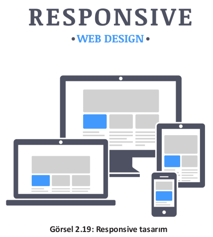

# 2.7. Uyumluluk
- <a href="#2.7.1.">2.7.1. Tarayıcı Uyumluluğu</a>
- <a href="#2.7.2.">2.7.2. Duyarlı (Responsive) Tasarım</a>
  
Bir web sitesinin görüntülendiği tüm platformlarda sorunsuz çalışması için tasarımcıların uyumluluk ile ilgili birtakım hususlara dikkat etmesi gerekir.

<h2 id="2.7.1.">2.7.1. Tarayıcı Uyumluluğu</h2>

Günümüzde internet ortamına erişim masaüstü bilgisayar, laptop, tablet veya akıllı telefonlar kullanılarak yapılmaktadır. Çeşitli amaçlar için hazırlanmış olan web sitelerini ziyaret edebilmek için **tarayıcı** adı verilen programlar kullanılır. Web sitelerinin veya web uygulamalarının mobil ortamlar ve farklı tarayıcılar ile uyumlu olması, hazırlanan içeriğin farklı tarayıcılarda farklı görüntü vermemeleri açısından önemlidir. Bir tarayıcının destekleyip diğerinin desteklemediği bir özellik ile karşı karşıya kalındığında ciddi görünüm bozuklukları meydana gelebilmektedir.\
Web siteleri tek bir tarayıcı üzerinden test edildiğinde, farklı tarayıcılar tarafından desteklenmeyen komut ve eklentilerle karşılaşılabilir. Bu komut ve eklentilerden dolayı da bir tarayıcıda çok iyi görünen web sitesi farklı tarayıcı veya aynı tarayıcının farklı versiyonlarında kötü görünecektir. Sitenin tüm platformlarda doğru çalışıp çalışmadığının kontrolü için **çapraz tarayıcı** testi **(cross browser testing)** adı verilen tarayıcı uyumluluk testleri kullanılır. Bu testler sayesinde web siteleri tüm tarayıcılar üzerinde aşama aşama test edilip henüz tasarım aşamasındayken bile nasıl göründüğü incelenir. Böylelikle farklı tarayıcı, cihaz ve platformları kullanan tüm kullanıcılar için tutarlı bir web deneyimi elde edilmiş olur.

**Araştırma**

>Çapraz tarama testi yapmak için kullanılabilecek araçları araştırıp sınıfta arkadaşlarınızla paylaşınız.

<h2 id="2.7.2.">2.7.2. Duyarlı (Responsive) Tasarım</h2>

Hazırlanacak olan web sitelerinin masaüstü bilgisayarların yanı sıra tablet ve mobil cihazlarla da uyumlu olması siteye daha çok erişim sağlanması açısından önemlidir. Bu uyumluluk duyarlı (responsive) tasarım olarak adlandırılır (Görsel 2.19).

Duyarlı tasarım ile web sitesi içeriğinin, siteyi görüntülemek için kullanılan tüm cihazlarda en iyi ve en kolay şekilde kullanılabilmesi sağlanır. Duyarlı olarak hazırlanmış web sitesi veya mobil uygulamalarda, ekran boyutu ve çözünürlüğü, kullanılan cihazın ekran boyutu ve çözünürlüğüne uygun olarak otomatik algılanacağından, içeriğin sağlıklı bir şeklide görüntülenmesi sağlanır. Yazıların, resimlerin, menülerin kayması engellenip, içeriğe ulaşmak için kaydırma veya yakınlaştırma sorunu ortadan kalkacak ve tüm elemanlar kullanılan ekranların genişliğine göre yeniden şekillenerek içeriğin ekrana tam oturması sağlanacaktır.\
Duyarlı web tasarımları hazırlayarak web sitelerinin farklı cihazlarla uyumlu olmasını sağlamak için bir CSS3 özelliği olan CSS Medya sorguları (CSS Media Query) kullanılır. Duyarlı web tasarımın yapı taşı olan Medya query özelliği sayesinde, yüksek piksele göre ayarlanmış olan bir web sitesi belli bir pikselin altına düştüğünde de orijinal görüntüyü korur.

**Araştırma**

>Mobil uygulama testleri için kullanılabilecek araçlardan birkaçını araştırıp sınıfta ar-
kadaşlarınızla paylaşınız.

Tasarımcıların dikkat etmesi gereken bir diğer nokta ise sitelerin arama motoru uyumluluğudur. Arama motorları da duyarlı tasarımı dikkate almaktadır. Duyarlı tasarıma sahip olan siteler arama sonuçlarında daha ön sıralarda yer alacaktır (2.20).

Web sitesi veya web uygulaması geliştirmek için kullanılan bazı teknolojiler her işletim sistemi ile uyumlu olmayabilir. Hazırlanan çalışmanın farklı işletim sistemi ile uyumluluk testinin de yapılması gerekir. Hazırlanan sitenin mobil cihazlarla uyumluluğunun kontrolü için farklı işletim sistemine sahip telefonlarda birebir test edilmesi de önemlidir.\
Web sayfasından çıktı almak gerekebilir. Bu tür durumlarda sağlıklı çıktılar alabilmek için sayfanın yazdırma seçenekleri ile uyumluluğu kontrol edilmelidir. Web sayfasından deneme amaçlı bir çıktı alınmalı ve sayfanın yazı tipi, hizalama, kenar boşlukları, kâğıt boyutu gibi özelliklerin uygun olup olmadığı kontrol edilmelidir.